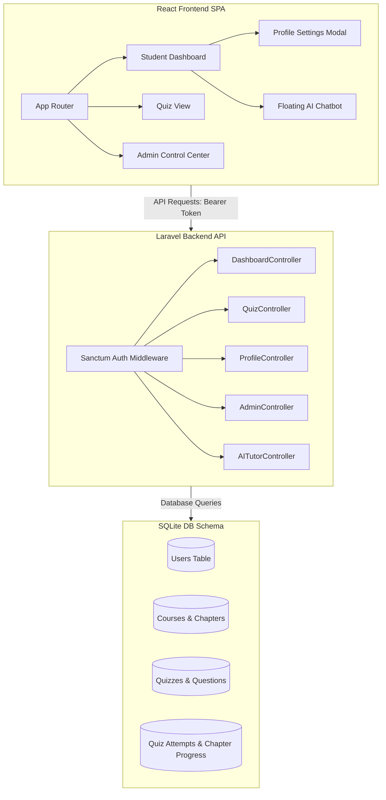

# QuantumLMS - Voice-Enabled Student Learning Platform

An interactive, gamified Learning Management System (LMS) designed for Grades 6–10 students, focusing on quantum physics education with AI tutoring, achievements, and administration panels.

---

Here is the visual walkthrough of the platform.

### 1. Student Dashboard & Custom Profiles
*A space-themed student learning center featuring progress tracks, badges, and user customization options.*
![Student Dashboard]

### 2. Interactive Chapter View
*Split-screen view with embedded lecture video player, PDF downloads, and real-time AI Tutor voice support.*
![Chapter View]

### 3. Gamified Assessments
*A clean assessment view with randomized questions, accuracy results, and instant celebration confetti.*
![Quiz Assessments]

### 4. Admin Management Console
*CRUD dashboards for managing courses, chapters, questions, student profiles, status toggles, and logs.*
![Admin Panel]

---

##  Features

### 🎓 Student Portal
* **Futuristic Space Theme**: Responsive, neon dark-mode interface built to keep middle-school students engaged.
* **Celebration Confetti**: Dynamic particle bursts upon chapter completion and scoring passing marks on quizzes.
* **Golden Certificate**: Automatic certificate generation with customized printing styles when progress hits 100%.

### 🏆 Gamified Badges
* **Quantum Cadet** (🎖️) - Completing Chapter 1
* **Gate Weaver** (🔮) - Completing Chapter 2
* **Composer Maestro** (🎹) - Completing Chapter 3
* **Quantum Scholar** (👑) - Scoring $\ge$ 80% on assessment quiz

### 🤖 Floating AI Support Buddy
* **Speech-to-Text & Text-to-Speech**: Speak directly to the tutor with real-time feedback audio read aloud.
* **Type Queries**: Classic text inputs for a quieter study experience.
* **Global Accessibility**: Available on the dashboard and assessment screens.

### ⚙️ Admin Controls
* **Student CRUD**: Create new accounts, edit credentials, or delete students.
* **Security & Toggles**: Block disabled students from accessing the portal.
* **Lesson Managers**: Full control over chapters, YouTube links, and quiz questions.

---

## 🛠️ Technology Stack

* **Backend**: Laravel (PHP), SQLite, Sanctum Token Auth
* **Frontend**: React (Vite), Tailwind CSS v4, GSAP (animations), canvas-confetti

---

## 📐 Detailed Architecture

This application is built on a **decoupled Client-Server Architecture** (SPA-API design), separating the React frontend client from the Laravel API backend service.



### 1. Database Relations Architecture
* **Users Table**: Stores students and administrators. Includes custom fields for profile edits (`phone`, `school_name`, `avatar_url`) and status control (`status: active/disabled`).
* **Courses to Chapters (1-to-Many)**: A course (e.g. *IBM Q Foundation*) owns multiple chapters. Each chapter holds description text, embedded YouTube links, and PDF URLs.
* **Chapter to User (Many-to-Many Pivot `chapter_user`)**: Tracks student lesson completions for calculating course progress percentages:
  $$\text{Progress \%} = \left(\frac{\text{Pivot Records Count}}{\text{Total Chapters Count}}\right) \times 100$$
* **Course to Quiz (1-to-1 relationship)**: Each course holds one final evaluation assessment.
* **Quiz to Quiz Questions (1-to-Many relationship)**: A quiz owns multiple multiple-choice questions (MCQs), storing question content and options A, B, C, D.
* **User to Quiz (Many-to-Many Pivot `quiz_attempts`)**: Logs each student's assessment attempt, recording their correct answers count, score, percentage, and timestamps.

### 2. Backend Security & Route Guarding
* **Token Authentication (Laravel Sanctum)**: Stateless Bearer token tokens are issued upon login, stored in browser LocalStorage, and verified on request headers.
* **Role Verification Middleware (`EnsureUserIsAdmin`)**: Verifies if the authenticated user's `role` column equals `'admin'`. Protects CRUD endpoints for courses, chapters, questions, and students.
* **Student Status Verification**: The login service inspects `status === 'disabled'` to block banned/inactive users and throw validation responses immediately.
* **Quiz Security**: Shuffles questions dynamically using `inRandomOrder()` at runtime and hides the `correct_option` field from JSON collections so students cannot inspect choices inside the browser network logs.

### 3. Frontend Architecture
* **Core Views**: Separate views for `/dashboard`, `/chapter/:id`, `/quiz/:id`, and protected `/admin`.
* **State Syncing**: Synchronizes profile data in state and LocalStorage dynamically when updating profiles or uploading image assets.
* **TTS/STT Integration**: Uses standard browser native APIs (`SpeechSynthesis` & `webkitSpeechRecognition`) in the global `<FloatingChatbot>` and `<AITutor>` components for interactive voice tutoring.

---

## 🔑 Default Test Credentials

Use the following accounts to test the different portals:

### 🎓 Student Portal
* **Email**: `merin@test.com`
* **Password**: `password123`

### ⚙️ Admin Dashboard
* **Email**: `admin@test.com`
* **Password**: `password123`

---

## Installation & Running

### Prerequisites
* PHP >= 8.2 & Composer
* Node.js >= 18 & npm

### 1. Backend Setup (Laravel)
```bash
cd backend
composer install
cp .env.example .env
# Configure database to sqlite in .env
php artisan migrate --seed
php artisan storage:link
php artisan serve
```

### 2. Frontend Setup (React)
```bash
cd frontend
npm install
npm run dev
```

